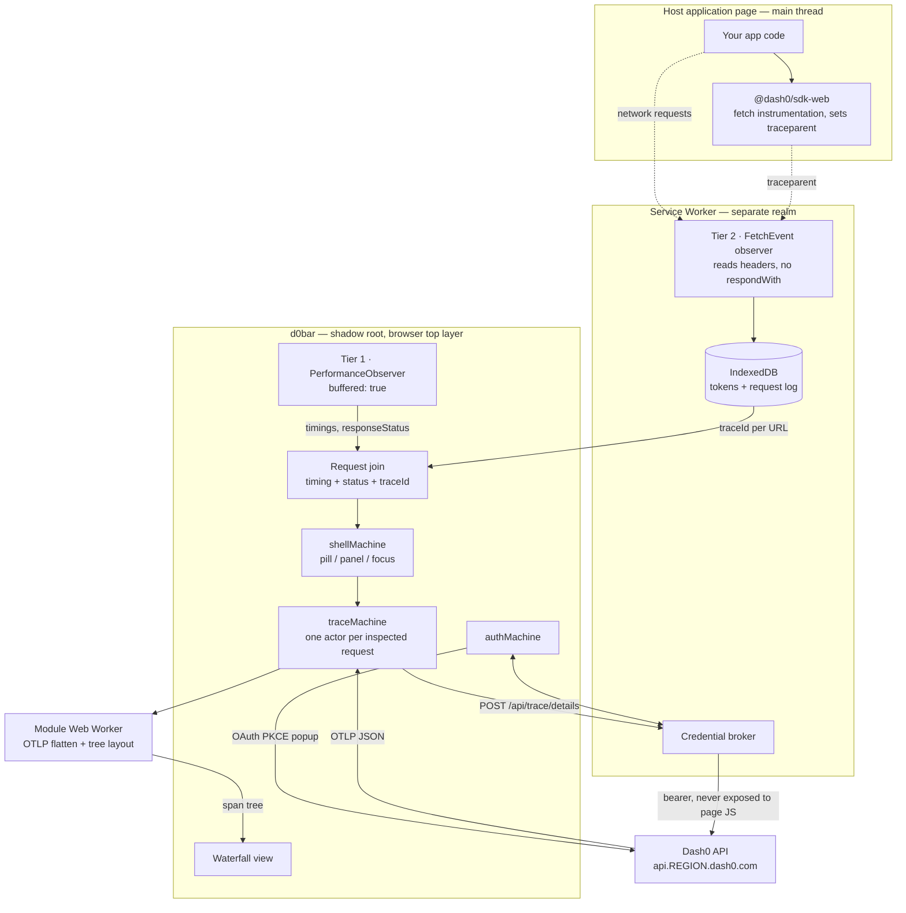
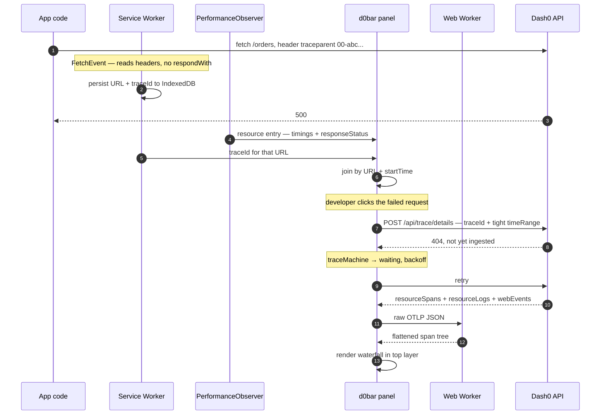
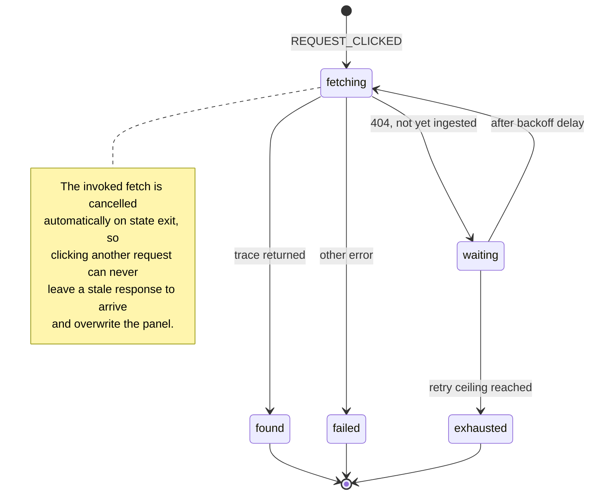
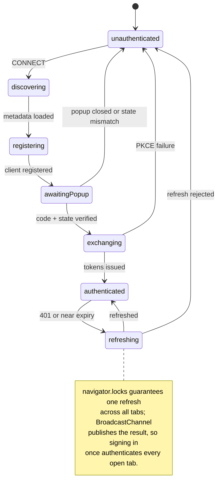

# d0bar — a Dash0 toolbar for your own app

_"dobar" (Serbian: good) with Dash0's zero dropped in._

## Context

Dash0 already owns both ends of a trace: `POST /api/trace/details` returns the browser web event,
the full distributed trace, **and** the correlated logs in one response. But a developer who
notices a slow page still has to leave the app, open `app.dash0.com`, find the session, find the
request, then find the trace.

d0bar closes that loop in place — a toolbar bundled into your own app that knows which page you
are on and jumps from a request the browser just made into its backend trace. No frontend-only
toolbar can do that, because none of them own the server side.

**Dogfood target is ready.** `dash0-ui` runs `@dash0/sdk-web` (44k page views / 24h, P75 LCP
4.53s), already allowlists `vercel.live` in its CSP (`components/ui/src/contentSecurityPolicy.ts:80`),
already permits `worker-src 'self' blob:`, and **has no Service Worker** — so the SW scope below
is free.

## Decisions taken

| Decision    | Choice                                                                |
| ----------- | --------------------------------------------------------------------- |
| Repo layout | Everything standalone in `d0bar`, one public npm package              |
| v0 scope    | Trace-jump vertical slice — this page's requests → full backend trace |
| Auth        | OAuth 2.1 PKCE from the start                                         |

## The governing constraint

An observability toolbar **must not distort what it measures**. A toolbar that patches `fetch`,
flattens a 4000-span trace on the main thread, and adds 40ms to INP is lying to you about your own
INP. Every choice below follows from that: browser-recorded measurements over self-instrumented
ones, observation without interception, heavy work off the main thread.

That is also why monkey-patching `fetch` is the wrong foundation — it changes the call it observes,
misses anything issued before the toolbar mounts, and fights every other library patching the same
global.

---

## Architecture

### Three tiers of observation

Each tier degrades independently. Tier 1 alone is a useful panel — no auth, no worker.

| Tier | Mechanism             | Supplies                                  | Requires                |
| ---- | --------------------- | ----------------------------------------- | ----------------------- |
| 1    | `PerformanceObserver` | Timings, `responseStatus`, vitals         | Nothing                 |
| 2    | Service Worker        | `traceparent`, token custody, durable log | HTTPS + a free SW scope |
| 3    | Declared fallback     | Tier 1 only, labeled degraded             | —                       |

#### Tier 1 — `PerformanceObserver` (always available, zero perturbation)

The browser already records every request with a full timing breakdown. d0bar reads it rather than
recreating it:

- `resource` → DNS/TCP/TLS/TTFB/transfer, `transferSize`, `nextHopProtocol`, `serverTiming`,
  `renderBlockingStatus`, and **`responseStatus`** (feature-detected; fall back to unlabeled status
  where unsupported).
- `largest-contentful-paint`, `layout-shift`, `event`, `long-animation-frame`, `navigation` →
  vitals with attribution, for free.

**`buffered: true` is the load-order fix.** d0bar can mount late — after hydration, after the
interesting requests already fired — and still receive every entry from page start. This makes late
mounting safe, and it covers exactly the gap a Service Worker has on first load.

`ReportingObserver` adds deprecations, interventions and CSP violations.

#### Tier 2 — Service Worker as correlator and credential broker

`PerformanceResourceTiming` deliberately exposes no request headers, so Tier 1 cannot see a
`traceparent`. A Service Worker can — and it lives outside the page's JS realm, so no globals are
touched.

**The critical detail: d0bar's SW never calls `event.respondWith()`.** It reads
`event.request.headers` and returns, letting the browser service the request natively. Observation
with no interception, no added latency, no changed caching semantics. Where a pass-through is ever
needed, `PerformanceResourceTiming.workerStart` measures the worker's own overhead, and the toolbar
discloses it rather than hiding it.

The SW is also the **credential broker**, and this is the payoff. Tokens live in the worker's own
IndexedDB; the worker attaches the bearer to d0bar's API calls. **The page's JavaScript never holds
the token** — which answers the one real weakness of a standalone same-origin bundle, that it has no
storage the host page cannot read.

The request log lives in that IndexedDB too, so it survives reloads: the request that caused the
error is still there after you refresh.

Honest costs: HTTPS or localhost only; one SW controls a scope, so d0bar ships an **importable
module** for apps that already have a worker; the SW does not control the first load until claimed —
Tier 1 covers that gap.

#### Tier 3 — declared fallback

No SW scope obtainable (the customer has one and will not import ours) → run Tier 1 only, label the
panel degraded, and say plainly what is missing. No silent monkey-patching as a consolation prize.

#### The join

Tier 1 is timing and status truth, keyed by URL + `startTime`. Tier 2 supplies `traceparent`, keyed
by URL + issue order. Join them into one request record; each tier stays the authority on what it
measures best.

---

## The core loop

---

## New capability this unlocks

The SDK instruments **`fetch` only — zero `XMLHttpRequest`** (0 occurrences in `dist/dash0.js`;
`instrumentations/http/` contains only `fetch.d.ts`). So XHR requests carry no `traceparent` and
produce no spans, and the SDK's `PropagatorConfig.match` regexes mean some fetches are deliberately
not propagated either.

A Service Worker sees all of them. So d0bar can report **instrumentation coverage**: _"3 of 11
requests on this page have no trace — 2 are XHR, which the SDK does not instrument; 1 is outside
your propagator's match list."_

That is a diagnostic about your observability setup that Dash0 **cannot** produce from the backend,
because the un-instrumented request never arrives. It falls out of this architecture for free.

---

## State: XState v5, for three specific problems

Not adopted wholesale — used where the state genuinely is a machine. There is no XState in the
monorepo today, so this is a new dependency in a standalone package.

### `traceMachine` — spawned per inspected request

The ingest-lag problem, and the most bug-prone part of the whole toolbar. A trace is not queryable
the instant a request finishes.

### `authMachine` — singleton

Concurrent 401s must trigger **one** refresh: an invoked actor plus event queueing handles it
in-tab, `navigator.locks.request()` handles it across tabs.

### `shellMachine`

Pill/panel routing, keyboard shortcut, focus management.

XState's inspect API means d0bar can render its own machines in dev — a good look for an
observability tool.

---

## Off the main thread

- **Module Web Worker** for OTLP flattening and span-tree layout — traces run to thousands of spans,
  and this work must not land on the thread whose INP we are reporting. `worker-src 'self' blob:` is
  already in dash0-ui's CSP.
- **`scheduler.postTask()` / `scheduler.yield()`** for residual main-thread work with explicit
  priorities, instead of `setTimeout` chunking.
- Typed `postMessage` protocol; add Comlink only if the RPC surface grows.

## Rendering: isolated by the platform, not by convention

- **Shadow root + `adoptedStyleSheets`** — constructed stylesheets, no `<style>` injection, no global
  rules.
- **Native `popover`** for the expanded panel → the browser's top layer, which ends the z-index war
  with the host's stacking contexts outright.
- **CSS anchor positioning**, progressively enhanced, to tether panel to pill.
- **Container queries** (`container-type: inline-size`) — the panel responds to its own size, not the
  viewport.
- **`contain: layout paint style`** — a hard guarantee that the toolbar cannot induce layout or paint
  work in the host. The governing constraint, expressed as one CSS declaration.
- **View Transitions** for panel ↔ trace navigation, progressively.

Preact via `preact/compat` for a bundle that ships inside someone else's app; one alias to swap.

---

## Implementation phases

**1 — Shell.** `@dash0/d0bar` (matching `@dash0/sdk-web`'s scope), Vite library build emitting ESM +
IIFE, vitest, ESLint/Prettier, SPDX headers per monorepo convention. Shadow root, popover, vendored
tokens, `shellMachine`, and an opt-in gate that makes the entire package a no-op unless explicitly
enabled. This is the layer that must never break a customer's page.

**2 — Tier 1 observation.** `PerformanceObserver` with `buffered: true`, `ReportingObserver`, and the
requests panel rendered from local state. **Ships value with no auth and no worker** — a "what did
this page actually do" panel.

**3 — Tier 2 worker.** SW registration, the importable-module variant, `traceparent` correlation
without `respondWith`, the IndexedDB request log, and the coverage diagnostics above. Tier 3 fallback
and its degraded labeling land here.

**4 — Auth.** `authMachine`, discovery → dynamic registration → popup → exchange → refresh, with the
SW holding the credential, Web Locks coordinating refresh, BroadcastChannel syncing tabs. Scopes come
from `scopes_supported`, never hardcoded; request the minimum that reads spans and logs. The consent
endpoint auto-submits for already-granted scopes, so returning developers get one click.

**5 — Trace jump.** `traceMachine` + worker-side OTLP flattening + waterfall. Send a **tight
`timeRange`** with every `POST /api/trace/details` — the schema warns that omitting it triggers a
full-table-scan fallback, and d0bar is the one client that knows the exact request timestamp. Render
`webEvents` as the browser-side root of the tree.

**6 — Integrations and docs.** `<D0bar />` for Next.js, a Vite plugin, a `<script>` build. README
covering config, the gate, the **CSP entries and same-origin SW file** a host app must serve (modeled
on the existing `vercel.live` entries), the tier model, and the security posture.

## Why this works from the host origin

The API sets `AllowAllOrigins = true` with header-only auth
(`components/api/internal/config/config.go:921`), and OAuth is already built for this exact client
shape — public clients, PKCE S256, dynamic registration, refresh tokens
(`modules/openapi-types/internal/spec/access-control/oauth-api.yml`). The SDK's own `authToken` is
ingest-only and unusable for reads, hence d0bar's own credential.

## Upstream work this depends on

None of it blocks phases 1–3.

1. **`@dash0/sdk-web` read API.** `sessionId` exists but is internal — the public entrypoint
   re-exports only `terminateSession`. Ask for `getSessionId()` and, ideally, an `onSignal`
   subscription. The tier stack does not depend on it; session-scoped views later will.
2. **XHR instrumentation** in the SDK — d0bar will make its absence visible, which is a good reason
   to close it.
3. **Redirect-URI policy.** Dynamic registration means registering the customer's own origin. The API
   only proxies OAuth (`components/api/internal/routes/oauth_proxy.go:28`) — confirm in
   `components/control-plane-api` that arbitrary https origins and `http://localhost:*` are accepted.
4. **Production CORS.** `AllowAllOrigins` is the _default_; the deployed value lives in
   `dash0-configuration`, which is not checked out locally.

## Verification

- **Preflight first** — `curl -X OPTIONS` a regional endpoint with an unrelated `Origin`. Do this
  before phase 4; it is the one assumption that could force an architecture change.
- **Observer-effect budget, enforced in CI** — a Playwright run loading a fixture page with the
  toolbar mounted and with it gated off, asserting the delta on INP, CLS and total blocking time
  stays under budget. Here that is a correctness test, not a nicety: the tool is disqualified if it
  perturbs the numbers it reports.
- **Unit (vitest)** — PKCE derivation; the Tier 1 ↔ Tier 2 join; OTLP flattening; and the machines
  tested as machines, driving `authMachine` and `traceMachine` through popup-closed, concurrent-401,
  ingest-lag and click-away-mid-fetch paths without a browser.
- **End-to-end on `dash0-ui`** — run locally per `LOCAL_SETUP.md`, add d0bar plus CSP entries and the
  SW file, trigger a request, click it, see the backend waterfall. Its empty SW scope means no
  conflict.
- **Independent cross-check** — take a `traceId` the toolbar displayed and fetch it via the Dash0 MCP
  `getTraceDetails` tool. The span sets must agree; catches flattening bugs the UI would hide.
- **Non-regression with the gate off** — zero network calls, zero registered workers, zero global
  style rules, and `fetch` verifiably unpatched.

## Explicitly not in v0

Vitals compared against the org's route P75 via PromQL, JS-error → error-span correlation, service
health and SLO burn, the session timeline, live log tailing over `ReadableStream`, and an "ask Agent0
why this page is slow" entry point seeded with session and trace ids. All layer onto phases 1–5
without redesign. Agent0 is the one I would reach for next — it turns the toolbar from a viewer into
a way in.
